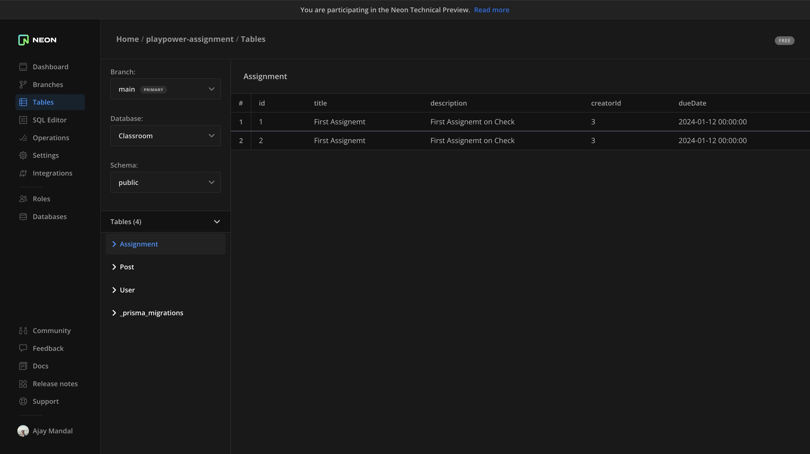
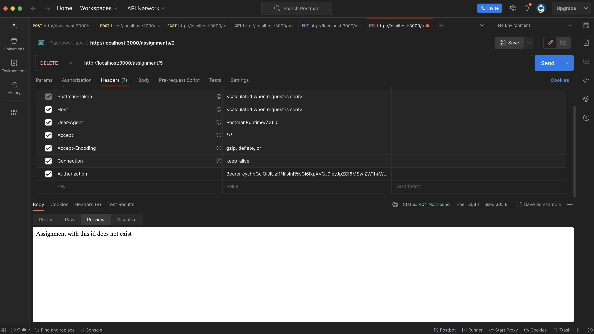
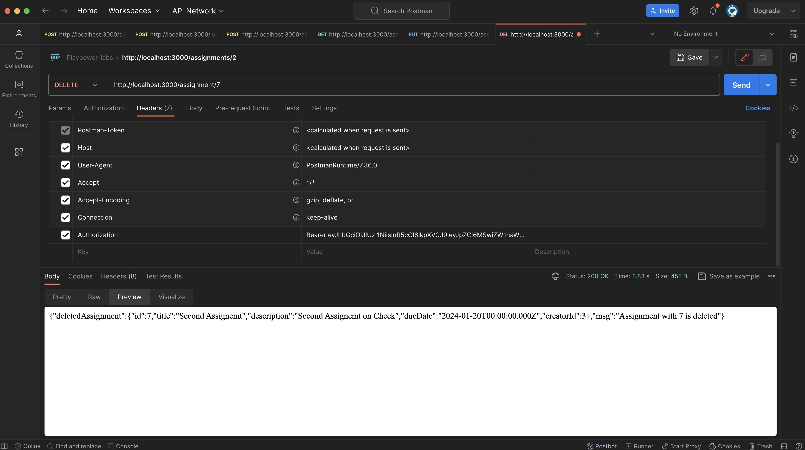
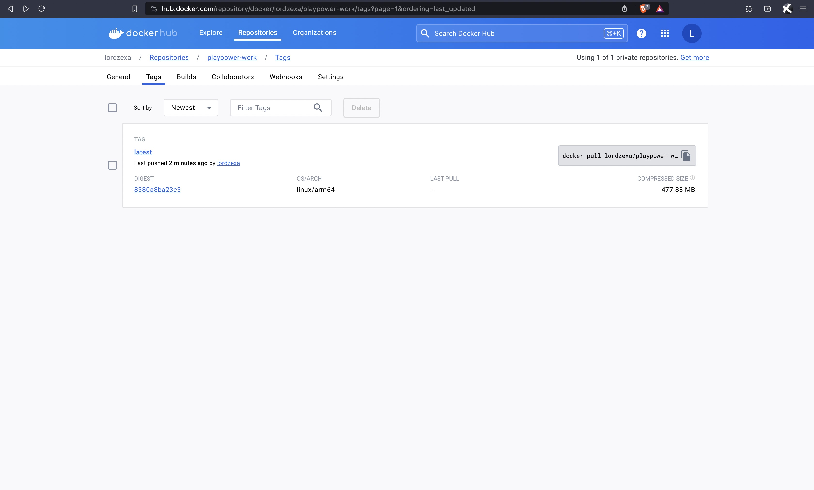

## Classroom - Backend API
Name : Ajay Kumar Mandal</br>
Email: ajayrox48@gmail.com </br>
Collage Email : 20btrco048@jainuniversity.ac.in </br>

### Technology Used
Scripting Language : Javascript </br>
For Backend : Nodejs, Express, Prisma </br>
For Database : PostgreSQL / NeonDB </br>
Other : jwswebtoken, cors </br>

## Features
- Authentication endpoints for Signup and Login
- Generate JWT token for registered user for further use
- Middleware for authenticating users before any assignment operation
- REST API Endpoints for adding new assignment
- REST API Endpoints for viewing all available assignment
- REST API Endpoints for modifying existing assignment
- REST API Endpoints to delete any assignment
- Created Dockerfile and published as private

## To Run Locally
1. Move to the directory
```
cd backend-classroom
```
2. Install Dependencies
```
npm install
```
3. Run the Server
```
node index.js
```
## Note
- I have included the Dockerfile to create a instance locally,  just run</br>
`docker build -t app-name .`
- My PC is ARM based so docker file image is using linux/arm but AMD image can en built using above command
- If you are using M1/M2 Macbook then use below command to directly add my image to your dockerhub </br>
`docker pull lordzexa/playpower-work:latest`

## API Documentation
Import this below file in Postman to check all backend calls</br>
[Link to JSON File](./postman-collection/Playpower_labs.postman_collection.json)

## Highlights

<h4>Assignments Created Using POST</h4>


<h4>Duplicate Assignments Modified Using PUT</h4>


<h4>Delete Endpoint Validation</h4>


<h4>Delete Endpoint</h4>


<h4>Dockerized and pushed to private repo</h4>

